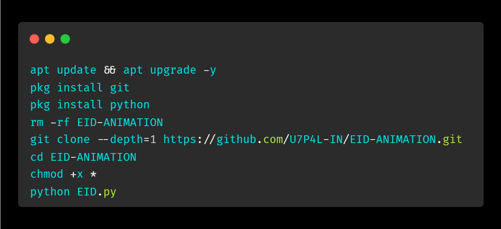

<h1 align="center">ANIMATED EID CELEBRATION</h1></br></br>

  <div align="center"><a href="https://github.com/U7P4L-IN/EID-ANIMATION/stargazers/"></a><a href="https://github.com/U7P4L-IN/EID-ANIMATION/network/members/"></a><a href="https://github.com/U7P4L-IN/EID-ANIMATION/issues"></div>
  <div align="center"></a><a href="https://github.com/U7P4L-IN/EID-ANIMATION/pull"></a><a href="https://github.com/U7P4L-IN/EID-ANIMATION/archive/refs/heads/master.zip"></a></div></br>

## Requirements 
```
python-3
pip
Internet Connection
And some other python packages
``` 
### Install Requirements (on Linux/Termux)

```python
>> pip insall espeak
```
### INSTALLATION >
```python
apt update && apt upgrade -y
pkg install git
pkg install python
rm -rf EID-ANIMATION
git clone --depth=1 https://github.com/U7P4L-IN/EID-ANIMATION.git
cd EID-ANIMATION
chmod +x *
python EID.py
```
<p align="center">

<p align="center">  <a href="https://t.me/TheU7p4lArmyX"></a></p>

</br>

# Report bugs
If you notice issues while installing this tool or running this tool kindly mail to me at <a href="mailto: lisame0007@gmail.com">Gmail</a> or Open an issue via github.

<h3 align="center"><b>DESCRIPTION</b></h3>
<p align="center">
</p>

> [!NOTE]  
> All the tools are belongs to their copyright owner, and this use is in accordance with the terms and conditions of the copyright holder.

# Give A Star ⭐

> You can also give this repository a star to show more people and they can use this repository